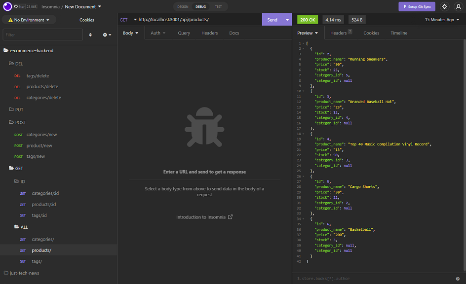

# E-commerce Back End

## Description

Ready to use back end logic for an E-commerce website. Allows GET, POST, PUT, and DEL fetches to update the underlying database.

---

## Table of Contents

- [Installation](#installation)
- [Usage](#usage)
- [Contributing](#contributing)
- [Tests](#tests)
- [Questions](#questions)

---

## Video walkthrough of the application: [Link](https://drive.google.com/file/d/13rL8mnEYDrD9a3X9BTcALelrHee6Hekb/view)

---

## Installation

Clone the reponsitory and run NPM Install to install the requireed libraries. Create a .env file at the root directory with the database credentials. Update the routes to connect to the database tables.

---

## Usage

Free to use.

---

## Contributing

Please provide a link to this repository.

---

## Tests

No tests created for this application.

---

## Questions

Please contact the owner with any questions.
Email: yiladien@hotmail.com
GitHub profile: https://github.com/Yiladien

---
